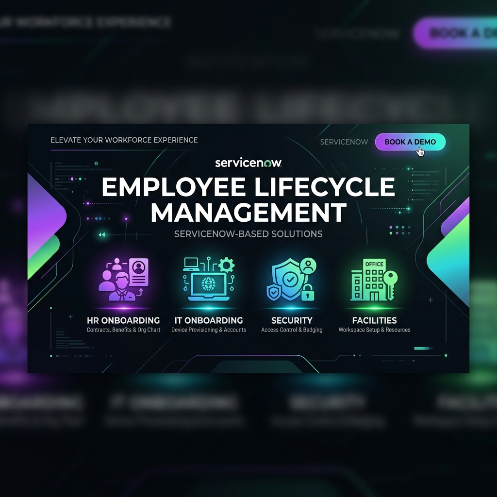
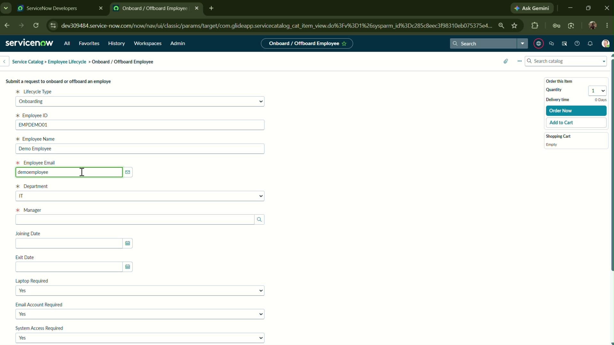
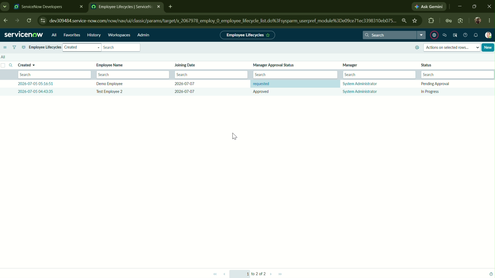
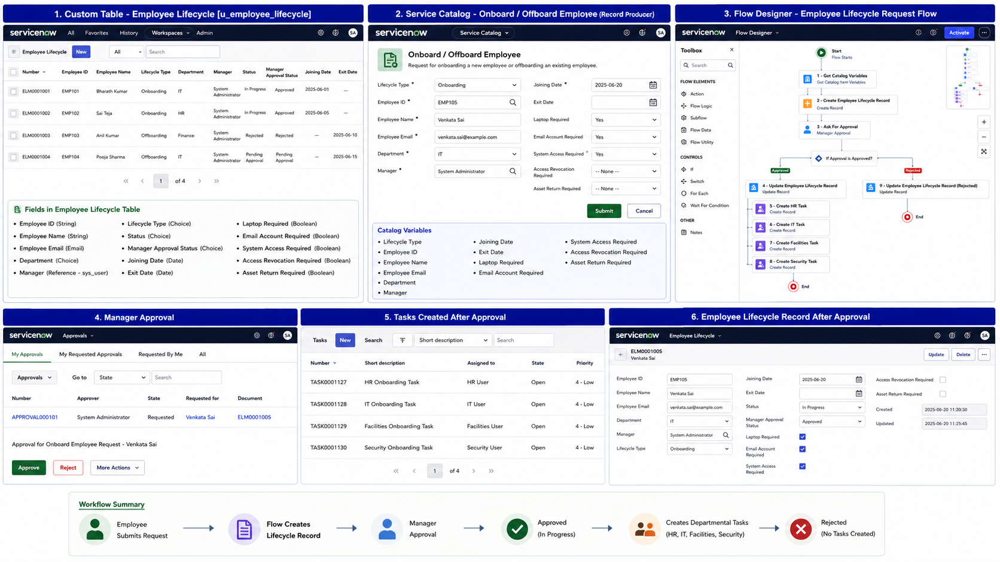
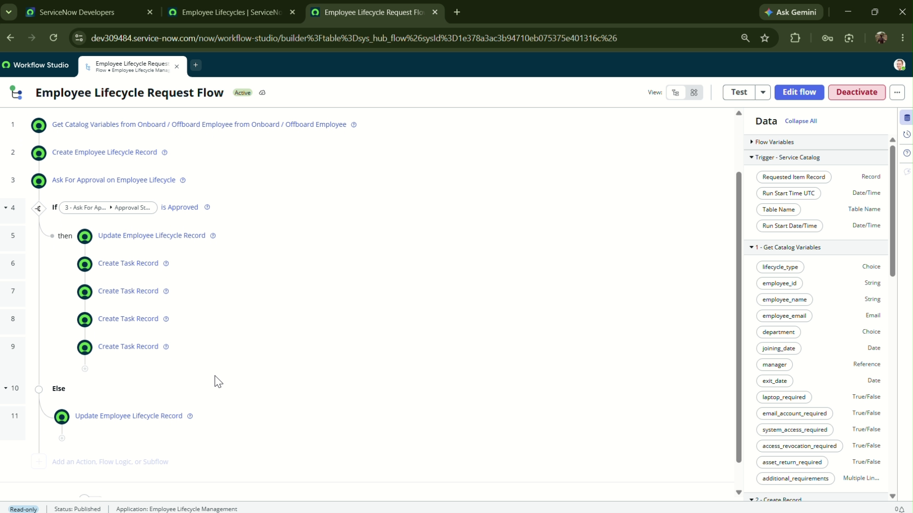
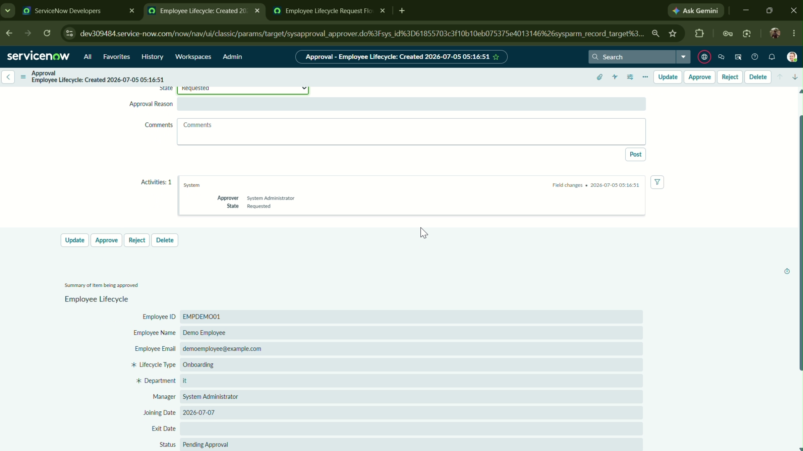
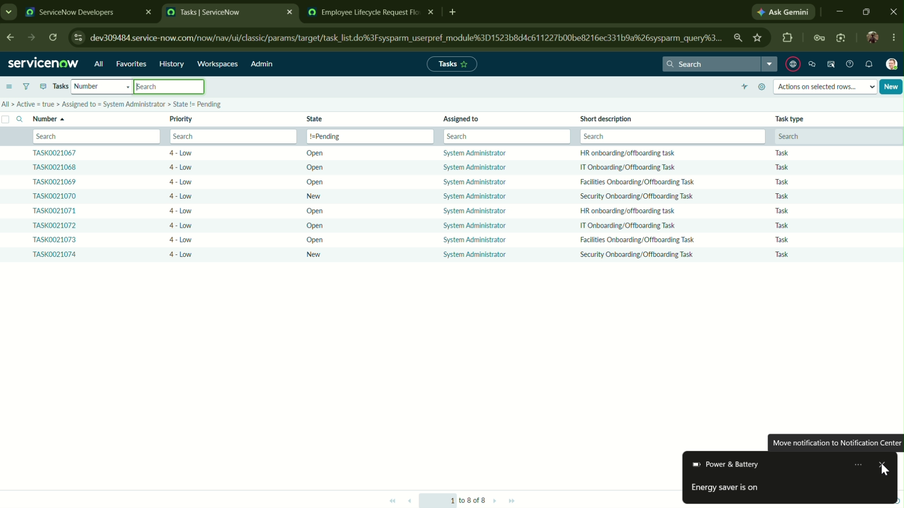
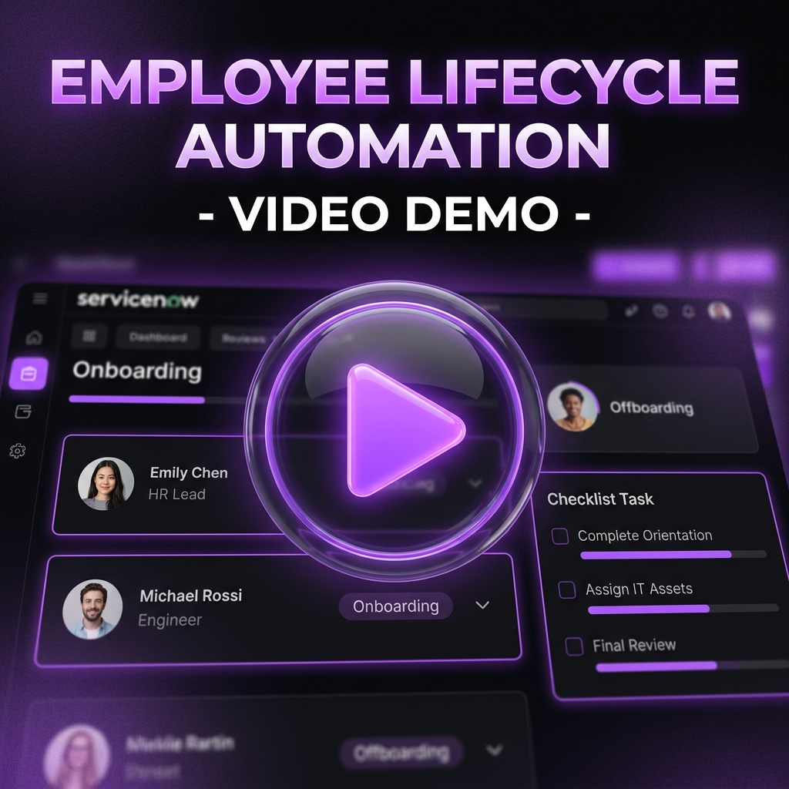

<div align="center">



<br/>

# 🚀 Employee Lifecycle Management System

### *A ServiceNow Application for Automated Onboarding and Offboarding*

<br/>

[](https://www.servicenow.com/)
[](#-flow-designer-automation)
[](#-employee-request-portal)
[](#-department-task-automation)

<br/>

> 🔄 Automates the **entire employee onboarding and offboarding lifecycle** — from catalog request submission to manager approval and departmental task creation — using **Service Catalog**, **Flow Designer**, **Approval Engine**, and **Task Management**.

<br/>

[📖 Overview](#-project-overview) · [✨ Features](#-features) · [🗄️ Database Design](#-custom-employee-lifecycle-table) · [🔄 Workflow](#-project-workflow) · [⚙ Flow Designer](#-flow-designer-automation) · [🔒 Manager Approval](#-manager-approval) · [📋 Task Automation](#-department-task-automation) · [📹 Demo](#-demo)

---

</div>

<br/>

## 📖 Project Overview

Coordinating employee onboarding and offboarding manually across multiple departments (HR, IT, Facilities, and Security) often results in delays, security risks, and administrative overhead. 

The **Employee Lifecycle Management System** solves these challenges by providing a centralized ServiceNow-based solution that automates request submission, routes approvals, tracks status changes, and auto-generates department-specific tasks.

<br/>

<div align="center">

| 🚫 **Manual Process Issues** | ✅ **Automated ServiceNow Solution** |
|:---|:---|
| Disconnected department coordination | Centralized Service Portal for request creation |
| Manual request tracking in sheets | Custom **Employee Lifecycle Table** (`u_employee_lifecycle`) |
| Delayed hardware, email, and access setup | Automated IT tasks upon manager approval |
| No verification or authorization audit trail | Integrated ServiceNow **Approval Engine** for line managers |
| Risk of access leaks during offboarding | Automatic task creation for Security and Access revocation |

</div>

<br/>

---

## ✨ Features

<div align="center">



*↑ ServiceNow Service Catalog - Onboard / Offboard Request Portal Form*

</div>

<br/>

<table>
<tr>
<td width="50%" valign="top">

### 💻 Employee Request Portal
- 📝 **Unified Catalog Form** for Onboarding and Offboarding.
- 🔍 **Dynamic Fields**: Show/hide options based on Onboarding or Offboarding choice.
- ⚡ **Auto-populates** manager information for request routing.

</td>
<td width="50%" valign="top">

### 🛡️ Manager Approval Engine
- 📩 **Automatic notifications** routed to the employee's manager.
- 🔘 **Approve/Reject buttons** directly on the approval record.
- 🔐 **State Enforcement**: Blocks task creation until approved.

</td>
</tr>
<tr>
<td width="50%" valign="top">

### ⚙️ Flow Designer Automation
- ⚡ **Triggered automatically** when a catalog request is submitted.
- 📑 **Auto-creates** a custom Lifecycle Table record.
- 🔄 Handles branching logic based on approval outcomes.

</td>
<td width="50%" valign="top">

### 📋 Department Task Automation
- 🚀 Generates specific tasks for **HR**, **IT**, **Facilities**, and **Security**.
- 🛠️ Assigns detailed work descriptions (laptop provisioning, badging, access).
- 🟢 Updates the main lifecycle record status dynamically.

</td>
</tr>
</table>

<br/>

---

## 🗄️ Custom Employee Lifecycle Table

The core data model `u_employee_lifecycle` stores all employee state and request details:

<div align="center">



*↑ Custom Table list view tracking multiple employee onboarding/offboarding workflows*

</div>

<br/>

| Field | DB Name | Type | Description |
|:---|:---|:---|:---|
| **Employee ID** | `u_employee_id` | String | Unique ID of the employee |
| **Employee Name** | `u_employee_name` | String | Full name of the employee |
| **Employee Email** | `u_employee_email` | Email | Contact email address |
| **Department** | `u_department` | Choice | IT, HR, Finance, Operations, Sales |
| **Manager** | `u_manager` | Reference → `sys_user` | Line manager (Approver) |
| **Joining Date** | `u_joining_date` | Date | Target start date (Onboarding only) |
| **Exit Date** | `u_exit_date` | Date | Target departure date (Offboarding only) |
| **Lifecycle Type** | `u_lifecycle_type` | Choice | `Onboarding` / `Offboarding` |
| **Status** | `u_status` | Choice | `New`, `Pending Approval`, `In Progress`, `Closed Complete`, `Rejected` |
| **Manager Approval Status** | `u_manager_approval_status` | Choice | `requested` / `Approved` / `Rejected` |
| **Laptop Required** | `u_laptop_required` | True/False | Onboarding equipment trigger |
| **Email Account Required** | `u_email_required` | True/False | IT mailbox provisioning trigger |
| **System Access Required** | `u_system_access_required` | True/False | Application access credential trigger |
| **Asset Return Required** | `u_asset_return_required` | True/False | Offboarding hardware collection trigger |
| **Access Revocation Required** | `u_access_revocation_required` | True/False | Offboarding credential cancellation trigger |

<br/>

---

## 🔄 Project Workflow

<div align="center">



*↑ Complete project architecture showing catalog variables mapping to custom tables, approvals, and tasks*

</div>

<br/>

### 📝 Step-by-Step Walkthrough

| Step | Participant | Action | System Outcome |
|:---:|:---|:---|:---|
| **1** | **User / HR** | Opens Service Portal | Accesses the catalog item |
| **2** | **User / HR** | Fills and Submits Request | Service Catalog triggers the Flow Designer |
| **3** | **Flow Designer** | Retrieves Variables | Creates a record in the custom `u_employee_lifecycle` table |
| **4** | **Approval Engine** | Requests Manager Approval | Manager receives Approval record (`requested` state) |
| **5** | **Manager** | Reviews Request | **Approves** or **Rejects** the request |
| **6a** | **Flow (Approved)** | updates fields | Status → `In Progress`, Approval Status → `Approved`. Creates **4 Departmental Tasks** |
| **6b** | **Flow (Rejected)** | updates fields | Status → `Rejected`, Approval Status → `Rejected`. Workflow ends. |

<br/>

---

## ⚙️ Flow Designer Automation

The flow automates data collection, approval routing, and task generation:

<div align="center">



*↑ ServiceNow Flow Designer configuration with multi-department tasks branch*

</div>

<br/>

### 🔧 Flow Configuration Logic

```
┌──────────────────────────────────────────────────────────┐
│  TRIGGER                                                 │
│  ────────                                                │
│  📋 Catalog Item: Onboard / Offboard Employee            │
└────────────────────────┬─────────────────────────────────┘
                         │
                         ▼
┌──────────────────────────────────────────────────────────┐
│  ACTION 1: Get Catalog Variables                         │
└────────────────────────┬─────────────────────────────────┘
                         │
                         ▼
┌──────────────────────────────────────────────────────────┐
│  ACTION 2: Create Employee Lifecycle Record              │
│  State: Pending Approval                                 │
└────────────────────────┬─────────────────────────────────┘
                         │
                         ▼
┌──────────────────────────────────────────────────────────┐
│  ACTION 3: Ask For Approval                              │
│  Approver: u_manager                                     │
└────────────────────────┬─────────────────────────────────┘
                         │
              ┌──────────┴──────────┐
              │                     │
        ✅ APPROVED           ❌ REJECTED
              │                     │
              ▼                     ▼
┌─────────────────────┐  ┌─────────────────────┐
│ 🟢 Update Record    │  │ 🔴 Update Record    │
│    Status →         │  │    Status →         │
│    "In Progress"    │  │    "Rejected"       │
│                     │  └─────────────────────┘
│ 📦 Create Tasks:    │
│   • HR Task         │
│   • IT Task         │
│   • Facilities Task │
│   • Security Task   │
└─────────────────────┘
```

<br/>

---

## 🔒 Manager Approval

Managers receive approval requests via the ServiceNow Approvals table:

<div align="center">



*↑ Line manager approval card view showing request details and action buttons*

</div>

- **Dynamic Approver Mapping**: Flow retrieves the employee's manager from user records and assigns the approval task.
- **Workflow Interlocking**: Downstream tasks remain locked until the approval action changes from `requested` to `Approved`.
- **Audit Trails**: Approval and rejection timestamps are persisted on the lifecycle record.

<br/>

---

## 📋 Department Task Automation

Once approved, 4 departmental tasks are generated under the ServiceNow Tasks table:

<div align="center">



*↑ Generated tasks for HR, IT, Facilities, and Security after request approval*

</div>

<br/>

| Department | Task Type | Description |
|:---:|:---|:---|
| **HR** | Onboarding Paperwork | Handle contracts, verify ID, and initiate onboarding orientation. |
| **IT** | Equipment & Access | Provision laptop/workstation, create email account, and configure system permissions. |
| **Facilities** | Workspace Setup | Allocate desk space, issue building access badges, and prepare workspace. |
| **Security** | Access & Credentials | Activate access permissions, set up security profiles, and configure security parameters. |

<br/>

---

## ✅ Testing Summary

### Onboarding Request Workflow
✔ **Catalog Submission**: Form values map correctly to flow inputs.  
✔ **Record Creation**: `u_employee_lifecycle` entry generated in `Pending Approval`.  
✔ **Approval Routing**: Approvals generated and routed to the assigned manager.  
✔ **Status Transition**: Approval updates status to `In Progress`.  
✔ **Task Generation**: 4 distinct tasks created for IT, HR, Facilities, and Security.  

### Offboarding Request Workflow
✔ **Catalog Submission**: Exit details populated.  
✔ **Manager Approval**: Approval routes correctly to the manager.  
✔ **Status Transition**: On rejection, status transitions to `Rejected` and exits.  
✔ **Task Generation**: Tasks successfully created for access revocation and asset return.  

<br/>

---

## 📹 Demo

<div align="center">

### 🎬 Watch the Full Project Walkthrough

<a href="(Add your Google Drive demo video link here)">
  
</a>

<br/><br/>

[](https://drive.google.com/file/d/18GXYoDpq4yrPP3UPghOVgHYBSSFa_4Or/view?usp=sharing)

> 👆 Click the thumbnail or button above to watch the complete employee lifecycle demonstration.

</div>

<br/>

---

## 🚀 Future Enhancements

- ⏱️ **SLA Management**: Track completion time for HR and IT tasks to ensure timely onboarding.
- 📧 **ServiceNow Email Notifications**: Automated emails on onboarding initiation, approval, and task completion.
- 📊 **Dashboards & KPIs**: Central portal reporting charts for managers showing onboarding pipeline.
- 🔐 **Role-Based ACL Security**: Read-only restrictions for employees, edit permissions for managers/fulfillment groups.
- 👥 **Department Assignment Groups**: Route IT/HR tasks directly to ServiceNow group queues rather than individuals.

<br/>

---

## 🎯 Learning Outcomes

Through this project, I gained hands-on experience with:
- **ServiceNow Application Development**: Database table design, choice list creation, and reference fields.
- **Service Catalog Design**: Building Record Producers, catalog variables, and form organization.
- **Flow Designer Automation**: Creating complex workflows, mapping variables, and conditional branching.
- **Approval Engine Integration**: Setting up manager approval rules and routing.
- **Fulfillment Task Management**: Auto-generation of tasks for multiple departments.

<br/>

---

## 👨‍💻 Developed By

**Chappa Bharath Kumar**
- B.Tech Information Technology
- Aditya College of Engineering & Technology
- ServiceNow Developer | Backend Developer | AI Enthusiast

<br/>

---

### ⭐ If you found this project helpful, consider giving this repository a Star!

<br/>

[](https://github.com/bharathkumar7733/Employee-Lifecycle-Management-ServiceNow)

<br/>

*Made with ❤️ using ServiceNow*